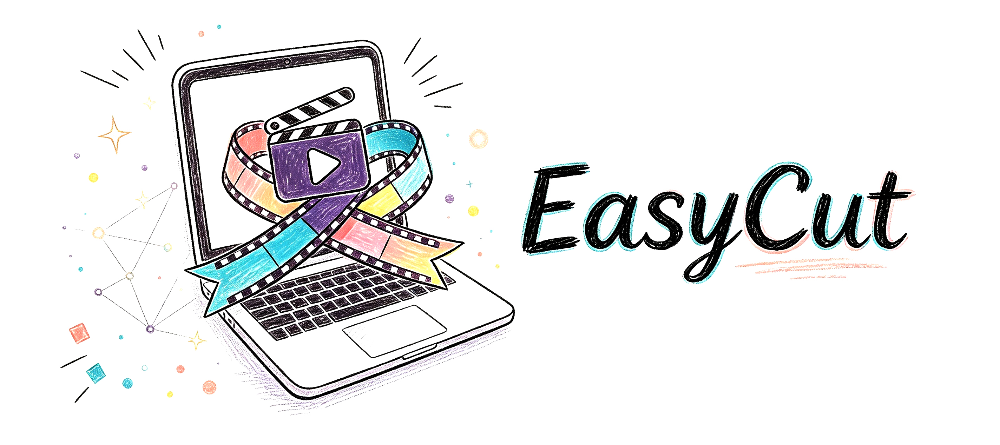

# EasyCut

录屏做完了，却还要手动找画面、对字幕、剪口误、配人声，最后导出时又发现音画不同步？

EasyCut 只需要一句话：它会把原始录屏、字幕和声音整理成一条可以直接发布的视频，自动处理字幕时序、配音同步、段首噪音、语速差异和导出检查。

## 一分钟开始

### 快速安装

把这段话发给 Codex 等 AI Agent：

帮我安装这个 skill：
https://github.com/Rimagination/easycut

基础流程需要 Python 和 ffmpeg；录音对齐需要 Whisper；声音克隆可以接入本地 Qwen3-TTS。没有本地 TTS 模型时，也可以先做字幕、剪辑和真人录音对齐。

### 案例一：给录屏加字幕和配音

直接告诉 Codex：

```text
把这个录屏做成教程视频：识别画面变化，配上字幕，使用我的录音，并导出剪映可以导入的字幕文件。
```

EasyCut 会先检查视频，再把字幕放到对应画面，清理录音中的口误和停顿，最后输出同步的视频、ASS 字幕和 SRT 字幕。

### 案例二：只给还没配音的字幕克隆音色

提供视频、SRT 和参考音频，并告诉 Codex：

```text
只给后面还没有配音的字幕生成克隆音色，字幕起点保持不变；每段单独生成，去掉段首噪音，必要时调整字幕终点。
```

EasyCut 会保留已经读过的字幕，只生成缺失部分。每段语音先单独清理，再按固定起点放回时间线，避免拼接后重复出现一秒左右的噪音，也避免整条音轨被拉伸得忽快忽慢。

### 案例三：先试听一句

```text
只配音这句话：“装好以后去复制 GitHub 上的提示词”，先给我一个 MP3 试听。
```

EasyCut 会生成独立 WAV 和 MP3，不会重新生成整段视频的旁白。

## EasyCut 会处理什么？

- 检查视频时长、分辨率、帧率、原始音频和关键画面
- 根据画面和字幕建立 `timeline.json`
- 对齐真人录音，识别重复、口误、停顿和重录片段
- 调用 `qwen-voiceover` 生成本地 Qwen 克隆音色
- 只处理未配音字幕，保留用户手打台词和准确的字幕起点
- 清理每段 TTS 的段首伪噪音，再进行拼接和音画同步
- 按句调整语速，必要时只调整字幕终点，不移动准确起点
- 增强人声、降噪、统一最终混音响度
- 添加箭头、框选和重点说明等 callout
- 导出 ASS、UTF-8 BOM SRT、GB18030 SRT 和最终 MP4
- 用 `ffprobe`、音量检测和关键帧抽查完成最终 QA

## 输出文件

典型项目会保留这些中间结果，方便继续编辑：

- `timeline.json`
- `missing_only.srt` 或 Qwen 时间戳脚本
- `segments_raw/` 和 `segments_clean/`
- `voiceover.manifest.json`
- `aligned_voice.wav` 或 `voiceover.wav`
- `subtitles.ass`
- `subtitles_adjusted.srt`
- `*_jianying_utf8_bom.srt` 和 `*_jianying_gb18030.srt`
- `final.mp4` 与 QA 关键帧

## 依赖与边界

EasyCut 负责视频理解、字幕、音画同步、音频清理、callout、渲染和 QA。Qwen 语音生成由配套的 `qwen-voiceover` skill 负责。推荐使用本地 Qwen3-TTS 0.6B；模型下载时可以使用 ModelScope 国内镜像，正式推理使用本地文件，避免制作过程中临时下载模型。

## 许可

本项目采用 MIT License。
